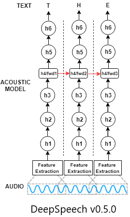

# Automatic Speech Recognition (ASR) - DeepSpeech German

_This is the project for the paper [German End-to-end Speech Recognition based on DeepSpeech](https://www.researchgate.net/publication/336532830_German_End-to-end_Speech_Recognition_based_on_DeepSpeech) published at [KONVENS 2019](https://2019.konvens.org/)._

This project aims to develop a working Speech to Text module using [Mozilla DeepSpeech](https://github.com/mozilla/DeepSpeech), which can be used for any Audio processing pipeline. [Mozillla DeepSpeech](https://github.com/mozilla/DeepSpeech) is a state-of-the-art open-source automatic speech recognition (ASR) toolkit. DeepSpeech is using a model trained by machine learning techniques based on [Baidu's Deep Speech](https://gigaom2.files.wordpress.com/2014/12/deep_speech3_12_17.pdf) research paper. Project DeepSpeech uses Google's TensorFlow to make the implementation easier.

<p align="center">
	
</p>


## Important Links:

**Paper:** https://www.researchgate.net/publication/336532830_German_End-to-end_Speech_Recognition_based_on_DeepSpeech

**DeepSpeech-API:** https://github.com/AASHISHAG/DeepSpeech-API

This Readme is written for [DeepSpeech v0.5.0](https://github.com/mozilla/DeepSpeech/releases/tag/v0.5.0). Refer to [Mozillla DeepSpeech](https://github.com/mozilla/DeepSpeech) for lastest updates.

## Contents

1. [Requirements](#requirements)
2. [Speech Corpus](#speech-corpus)
3. [Language Model](#language-model)
4. [Training](#training)
5. [Hyper-Paramter Optimization](#hyper-paramter-optimization)
6. [Results](#results)
7. [Trained Models](#trained-models)
8. [Acknowledgments](#acknowledgments)
9. [References](#references)

### Requirements

#### Installing Python bindings

```
virtualenv -p python3 deepspeech-german
source deepspeech-german/bin/activate
pip3 install -r python_requirements.txt
```

#### Installing Linux dependencies

The necessary Linux dependencies can be found in linux_requirements.

```
xargs -a linux_requirements.txt sudo apt-get install
```

#### Mozilla DeepSpeech
```
$ wget https://github.com/mozilla/DeepSpeech/archive/v0.5.0.tar.gz 
$ tar -xzvf v0.5.0.tar.gz
$ mv DeepSpeech-0.5.0 DeepSpeech
```

### Speech Corpus

* [German Distant Speech Corpus (TUDA-De)](https://www.inf.uni-hamburg.de/en/inst/ab/lt/resources/data/acoustic-models.html) ~127h
* [Mozilla Common Voice](https://voice.mozilla.org/) ~140h
* [Voxforge](http://www.voxforge.org/home/forums/other-languages/german/open-speech-data-corpus-for-german) ~35h


- **Download the corpus**

**1. _Tuda-De_**
```
$ mkdir tuda
$ cd tuda
$ wget http://www.repository.voxforge1.org/downloads/de/german-speechdata-package-v2.tar.gz
$ tar -xzvf german-speechdata-package-v2.tar.gz
```

**2. _Mozilla_**
```
$ cd ..
$ mkdir mozilla
$ cd mozilla
$ wget https://voice-prod-bundler-ee1969a6ce8178826482b88e843c335139bd3fb4.s3.amazonaws.com/cv-corpus-2/de.tar.gz
```
 
**3. _Voxforge_**
```
$ cd ..
$ mkdir voxforge
$ cd voxforge
```

```python
from audiomate.corpus import io
dl = io.VoxforgeDownloader(lang='de')
dl.download(voxforge_corpus_path)
```

- **Prepare the Audio Data**

```
$ cd ..
$ ##Tuda-De
$ git clone https://github.com/AASHISHAG/deepspeech-german.git
$ deepspeech-german/pre-processing/prepare_data.py --tuda $tuda_corpus_path  $export_path_data_tuda

$ ##Voxforge
$ deepspeech-german/pre-processing/run_to_utf_8.sh
$ python3 deepspeech-german/prepare_data.py --voxforge $voxforge_corpus_path $export_path_data_voxforge

$ ##Mozilla Common Voice
$ python3 DeepSpeech/bin/import_cv2.py --deepspeech-german/data/alphabet.txt $export_path_data_mozilla
```

_NOTE: Change the path accordingly in run_to_utf_8.sh_

### Language Model

We used [KenLM](https://github.com/kpu/kenlm.git) toolkit to train a 3-gram language model. It is Language Model inference code by [Kenneth Heafield](https://kheafield.com/)

- **Installation**

```
$ git clone https://github.com/kpu/kenlm.git
$ cd kenlm
$ mkdir -p build
$ cd build
$ cmake ..
$ make -j `nproc`
```

- **Corpus**

We used an open-source [German Speech Corpus](http://ltdata1.informatik.uni-hamburg.de/kaldi_tuda_de/German_sentences_8mil_filtered_maryfied.txt.gz) released by [University of Hamburg](https://www.inf.uni-hamburg.de/en/inst/ab/lt/resources/data/acoustic-models.html).

1. Download the data

```
$ wget http://ltdata1.informatik.uni-hamburg.de/kaldi_tuda_de/German_sentences_8mil_filtered_maryfied.txt.gz
$ gzip -d German_sentences_8mil_filtered_maryfied.txt.gz
```

2. Pre-process the data

```
$ deepspeech-german/pre-processing/prepare_vocab.py $text_corpus_path $exp_path/clean_vocab.txt
```

3. Build the Language Model
```
$kenlm/build/bin/lmplz --text $exp_path/clean_vocab.txt --arpa $exp_path/words.arpa --o 3
$kenlm/build/bin/build_binary -T -s $exp_path/words.arpa $exp_path/lm.binary
```

#### NOTE: use [-S](https://kheafield.com/code/kenlm/estimation/) memoryuse_in_%, if malloc expection occurs
Example:
```
$kenlm/build/bin/lmplz --text $exp_path/clean_vocab.txt --arpa $exp_path/words.arpa --o 3 -S 50%
```

### Trie

To build _Trie_ for the above trained _Language Model._

#### Requirements

* [General TensorFlow requirements](https://www.tensorflow.org/install/install_sources)
* [libsox](https://sourceforge.net/projects/sox/)
* [SWIG >= 3.0.12](http://www.swig.org/)
* [node-pre-gyp](https://github.com/mapbox/node-pre-gyp)

1. Build Native Client.

```
# The DeepSpeech tools are used to create the trie
$ git clone https://github.com/mozilla/tensorflow.git
$ cd tensorflow
$ git checkout origin/r1.13
$ ./configure
$ ln -s ../DeepSpeech/native_client ./
$ bazel build --config=monolithic -c opt --copt=-O3 --copt="-D_GLIBCXX_USE_CXX11_ABI=0" --copt=-fvisibility=hidden //native_client:libdeepspeech.so //native_client:generate_trie --config=cuda
```

_NOTE_: 

Flags used to configure TensorFlow

```
Do you wish to build TensorFlow with XLA JIT support? [Y/n]: n
Do you wish to build TensorFlow with OpenCL SYCL support? [y/N]: N
Do you wish to build TensorFlow with ROCm support? [y/N]: N
Do you wish to build TensorFlow with CUDA support? [y/N]: y
Do you wish to build TensorFlow with TensorRT support? [y/N]: N
Do you want to use clang as CUDA compiler? [y/N]: N
Do you wish to build TensorFlow with MPI support? [y/N]: N
Would you like to interactively configure ./WORKSPACE for Android builds? [y/N]: N
```

_Refer [Mozilla's documentation](https://github.com/mozilla/DeepSpeech/tree/master/native_client) for updates. We used **Bazel Build label: 0.19.2** with **DeepSpeechV0.5.0**_

2. Build Trie
```
$ DeepSpeech/native_client/generate_trie $path/alphabet.txt $path/lm.binary $exp_path/trie
```

### Training

Define the path of the corpus and the hyperparameters in _deepspeech-german/train_model.sh_ file.

```
$ nohup deepspeech-german/train_model.sh &
```

### Hyper-Paramter Optimization

Define the path of the corpus and the hyperparameters in _deepspeech-german/hyperparameter_optimization.sh_ file.

```
$ nohup deepspeech-german/hyperparameter_optimization.sh &
```

### Results

Some results from our findings.

- Mozilla 79.7%
- Voxforge 72.1%
- Tuda-De 26.8%
- Tuda-De+Mozilla 57.3%
- Tuda-De+Voxforge 15.1%
- Tuda-De+Voxforge+Mozilla 21.5%

_NOTE: Refer our paper for more information._

### Trained Language Model, Trie, Speech Model and Checkpoints

The DeepSpeech model can be directly re-trained on new dataset. The required dependencies are available at:

https://drive.google.com/drive/folders/1nG6xii2FP6PPqmcp4KtNVvUADXxEeakk?usp=sharing

https://drive.google.com/file/d/1VN1xPH0JQNKK6DiSVgyQ4STFyDY_rle3/view

## Acknowledgments
* [Prof. Dr.-Ing. Torsten Zesch](https://www.ltl.uni-due.de/team/torsten-zesch) - Co-Author
* [Dipl.-Ling. Andrea Horbach](https://www.ltl.uni-due.de/team/andrea-horbach)
* [Matthias](https://github.com/ynop/audiomate)

 
## References
If you use our findings/scripts in your academic work, please cite:
```
@inproceedings{agarwal-zesch-2019-german,
    author = "Aashish Agarwal and Torsten Zesch",
    title = "German End-to-end Speech Recognition based on DeepSpeech",
    booktitle = "Preliminary proceedings of the 15th Conference on Natural Language Processing (KONVENS 2019): Long Papers",
    year = "2019",
    address = "Erlangen, Germany",
    publisher = "German Society for Computational Linguistics \& Language Technology",
    pages = "111--119"
}
```
<!--  An open-access Arxiv preprint is available here: -->